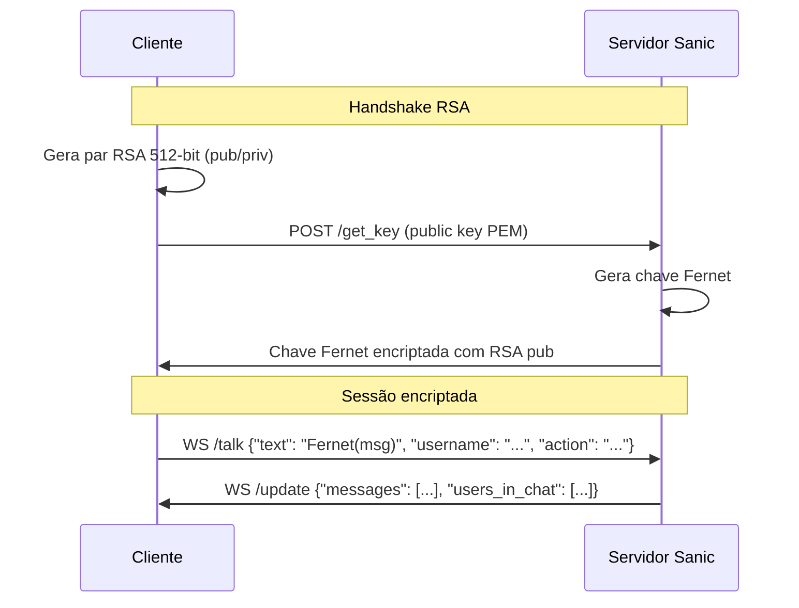

<div align="center">

# cmd-chat

[](https://github.com/ESousa97/cmd-chat/actions/workflows/ci.yml)
[](https://www.codefactor.io/repository/github/esousa97/cmd-chat)
[](https://opensource.org/licenses/MIT)
[](#)

**Chat de linha de comando com criptografia end-to-end — handshake RSA 512-bit para troca segura de chaves simétricas + Fernet para encriptação da sessão, servidor assíncrono Sanic com 3 endpoints WebSocket (`/talk` para mensagens, `/update` para sincronização de estado, `/get_key` para handshake RSA com PEM), validação de payloads via Pydantic, interface Rich/Colorama com cores por IP e username, geração automática de usernames aleatórios (ex.: `SmartFox52`, `BraveLion12`), autenticação por `ADMIN_PASSWORD`, instalável via `pip install -e .` com executável `cmd_chat` no PATH.**

</div>

---

> **⚠️ Projeto Arquivado**
> Este projeto não recebe mais atualizações ou correções. O código permanece disponível como referência e pode ser utilizado livremente sob a licença MIT. Fique à vontade para fazer fork caso deseje continuar o desenvolvimento.

---

## Índice

- [Sobre o Projeto](#sobre-o-projeto)
- [Demonstração](#demonstração)
- [Funcionalidades](#funcionalidades)
- [Tecnologias](#tecnologias)
- [Arquitetura](#arquitetura)
- [Começando](#começando)
  - [Pré-requisitos](#pré-requisitos)
  - [Instalação](#instalação)
  - [Uso](#uso)
- [Endpoints WebSocket](#endpoints-websocket)
- [Scripts Disponíveis](#scripts-disponíveis)
- [FAQ](#faq)
- [Licença](#licença)
- [Contato](#contato)

---

## Sobre o Projeto

Chat de linha de comando que permite criar salas de chat criptografadas pelo terminal. Todas as mensagens são encriptadas usando criptografia híbrida: chaves simétricas Fernet negociadas com segurança via chaves assimétricas RSA 512-bit.

O repositório prioriza:

- **Criptografia híbrida end-to-end** — Handshake RSA 512-bit para troca segura de chave simétrica + Fernet (AES-128-CBC com HMAC) para encriptação de cada mensagem da sessão. O endpoint `/get_key` recebe a public key do cliente em formato PEM e retorna a chave Fernet encriptada com RSA
- **Servidor assíncrono Sanic** — 3 endpoints WebSocket: `/talk` para envio de mensagens encriptadas em Fernet, `/update` para sincronização contínua de mensagens e lista de usuários online, `/get_key` para handshake RSA com PEM. Armazenamento in-memory do estado da sala
- **Validação de contratos via Pydantic** — Payloads WebSocket validados com modelos Pydantic: `/talk` com formato `{"text": "<enc_msg>", "username": "...", "action": "..."}`, `/update` com `{"messages": [...], "users_in_chat": [...]}`
- **Interface CLI com Rich/Colorama** — Terminal limpo e colorido com cores por IP e username, renderização Rich quando disponível com fallback para renderização padrão
- **Username aleatório e autenticação** — Geração automática de nomes ao ingressar (ex.: `SmartFox52`, `BraveLion12`), autenticação do servidor via `ADMIN_PASSWORD` configurável
- **Instalável como executável** — `pip install -e .` registra `cmd_chat` no PATH com subcomandos `serve` e `connect`

---

## Demonstração


**Iniciando o servidor:**

```bash
cmd_chat serve 127.0.0.1 5000 -p "senha_super_secreta"
```

**Conectando um cliente** (em outro terminal):

```bash
cmd_chat connect 127.0.0.1 5000 "senha_super_secreta"
```

---

## Funcionalidades

- **Comunicação encriptada** — RSA 512-bit para troca segura de chaves + Fernet para sessão simétrica, criptografia end-to-end em todas as mensagens
- **Servidor assíncrono** — Sanic com alta performance para rotas HTTP e WebSockets simultâneos
- **Rich UI** — Terminal colorido com cores por IP e username, renderização Rich com fallback padrão
- **Usernames aleatórios** — Geração automática ao ingressar no servidor (ex.: `SmartFox52`, `BraveLion12`)
- **Sincronização de estado** — Endpoint `/update` com lista de mensagens e usuários online em tempo real
- **Autenticação** — `ADMIN_PASSWORD` para controle de acesso ao servidor
- **Validação de payloads** — Contratos Pydantic para todos os payloads WebSocket
- **Instalável via pip** — `pip install -e .` com executável `cmd_chat` no PATH (`serve` e `connect`)

---

## Tecnologias


---

## Arquitetura



### Fluxo Criptográfico

1. Cliente gera par de chaves RSA 512-bit e envia public key em PEM via `/get_key`
2. Servidor gera chave simétrica Fernet, encripta com a public key RSA do cliente e retorna
3. Cliente decripta a chave Fernet com sua private key RSA
4. Todas as mensagens subsequentes são encriptadas/decriptadas com Fernet (AES-128-CBC + HMAC)

### Componentes

| Componente | Responsabilidade |
| --- | --- |
| **Servidor Sanic** | Rotas HTTP/WebSocket, gerenciamento de salas, armazenamento in-memory |
| **Handshake RSA** | `/get_key` — troca segura de chave simétrica via RSA 512-bit PEM |
| **Sessão Fernet** | `/talk` — encriptação simétrica de mensagens com chave negociada |
| **Sincronização** | `/update` — broadcast de mensagens e lista de usuários online |
| **Pydantic** | Validação de payloads WebSocket (text, username, action, messages, users) |
| **Rich/Colorama** | Renderização CLI com cores por IP/username, fallback padrão |

---

## Começando

### Pré-requisitos

- Python 3.10+
- pip e ambiente virtual

### Instalação

```bash
git clone https://github.com/ESousa97/cmd-chat.git
cd cmd-chat

# Ambiente virtual
python -m venv venv

# Linux/macOS
source venv/bin/activate

# Windows
.\venv\Scripts\activate

# Instalar
pip install -e .

# Configuração
cp .env.example .env
# Edite .env e defina ADMIN_PASSWORD
```

### Uso

**Servidor:**

```bash
cmd_chat serve 127.0.0.1 5000 -p "senha_super_secreta"
```

**Cliente** (em outro terminal):

```bash
cmd_chat connect 127.0.0.1 5000 "senha_super_secreta"
```

Um username aleatório é gerado automaticamente ao conectar. Digite suas mensagens e inicie a conversa.

Também é possível executar via `python cmd_chat.py` diretamente.

---

## Endpoints WebSocket

| Endpoint | Tipo | Payload | Descrição |
| --- | --- | --- | --- |
| `/talk` | WS | `{"text": "<enc_msg>", "username": "...", "action": "..."}` | Envio de mensagens encriptadas em Fernet |
| `/update` | WS | `{"messages": [...], "users_in_chat": [...]}` | Sincronização contínua de mensagens e usuários online |
| `/get_key` | POST/GET | Public key PEM → Fernet key encriptada com RSA | Handshake RSA para troca de chave simétrica |

---

## Scripts Disponíveis

```bash
# Lint
ruff check .

# Formatação
ruff format .

# Testes
pytest tests/
```

---

## FAQ

<details>
<summary><strong>A criptografia RSA 512-bit é segura para produção?</strong></summary>

RSA 512-bit é considerado inseguro para uso em produção — chaves desse tamanho podem ser fatoradas com recursos computacionais modernos. No contexto deste projeto educacional/demonstrativo, serve para ilustrar o conceito de criptografia híbrida. Para produção, use RSA 2048-bit ou superior (ou curvas elípticas).
</details>

<details>
<summary><strong>O chat persiste mensagens?</strong></summary>

Não. O armazenamento é totalmente in-memory no servidor Sanic. Ao encerrar o servidor, todas as mensagens e sessões são perdidas.
</details>

<details>
<summary><strong>Posso usar sem Rich instalado?</strong></summary>

Sim. O cliente possui fallback para renderização padrão quando Rich não está disponível. A experiência é melhor com Rich (cores, formatação), mas funciona sem ela.
</details>

<details>
<summary><strong>Como funciona a autenticação?</strong></summary>

O servidor aceita uma senha via flag `-p` no `cmd_chat serve`. Clientes devem fornecer a mesma senha no `cmd_chat connect`. A validação ocorre na conexão WebSocket.
</details>

---

## Licença

Este projeto está sob a licença MIT. Veja o arquivo [LICENSE](LICENSE) para mais detalhes.

```
MIT License - você pode usar, copiar, modificar e distribuir este código.
```

---

## Contato

**José Enoque Costa de Sousa**

[](https://www.linkedin.com/in/enoque-sousa-bb89aa168/)
[](https://github.com/ESousa97)
[](https://enoquesousa.vercel.app)

---

<div align="center">

**[⬆ Voltar ao topo](#cmd-chat)**

Feito com ❤️ por [José Enoque](https://github.com/ESousa97)

**Status do Projeto:** Archived — Sem novas atualizações

</div>
